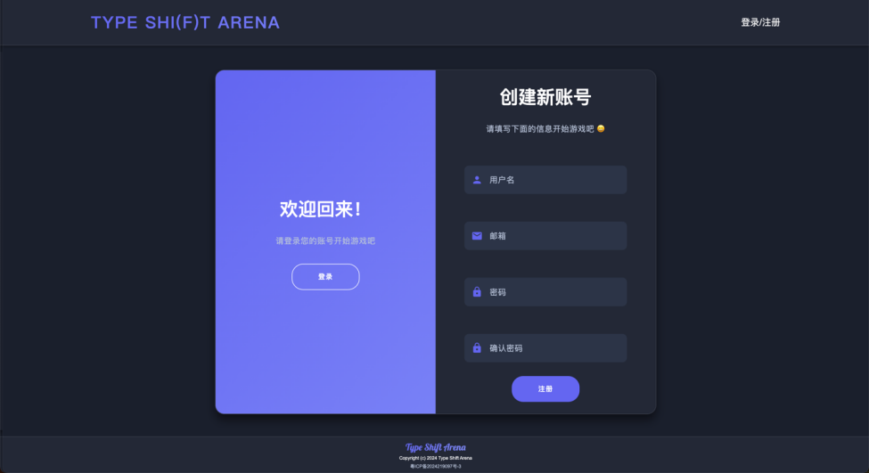
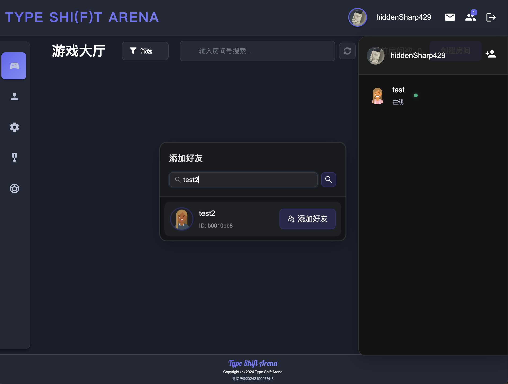
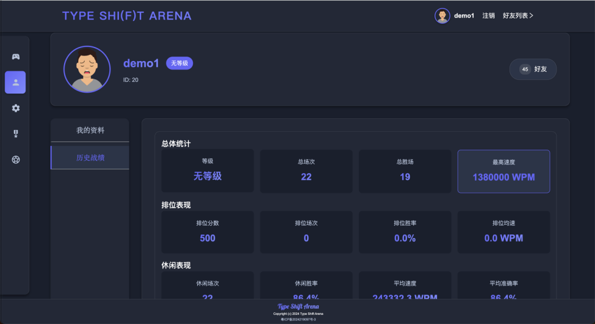
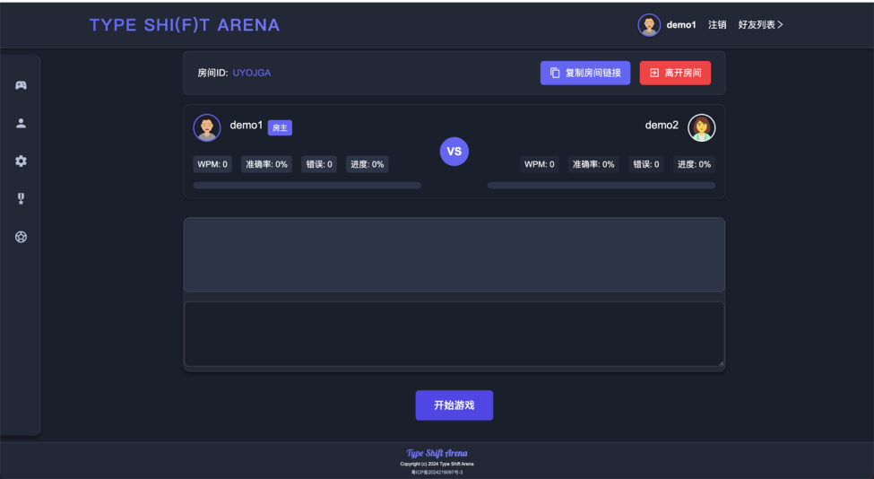
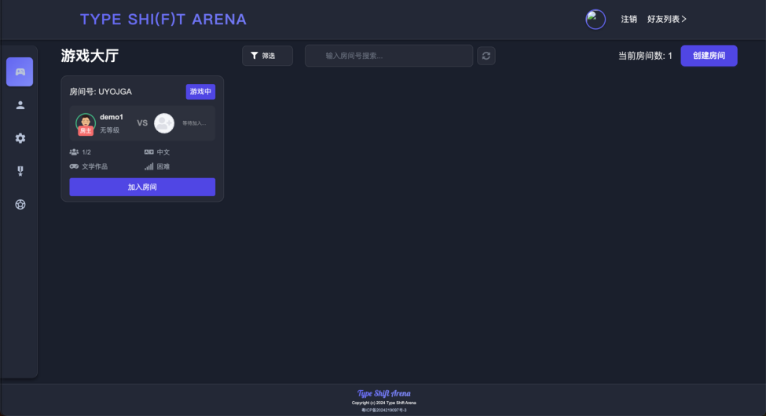
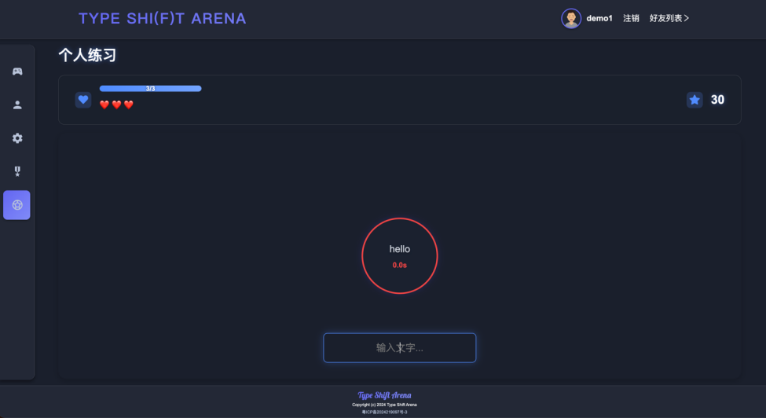
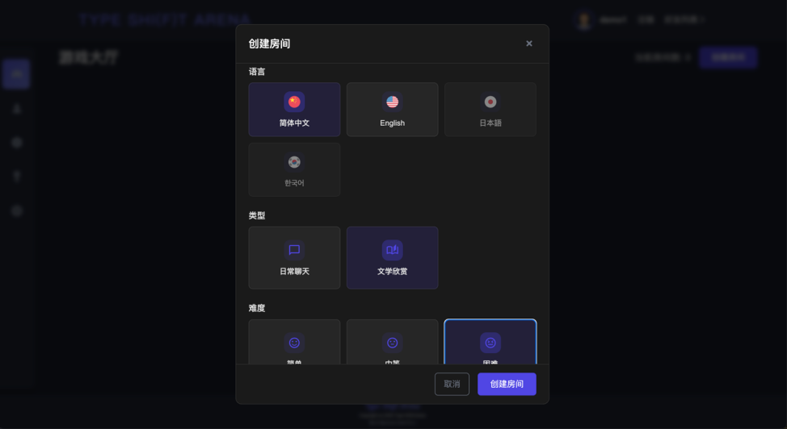
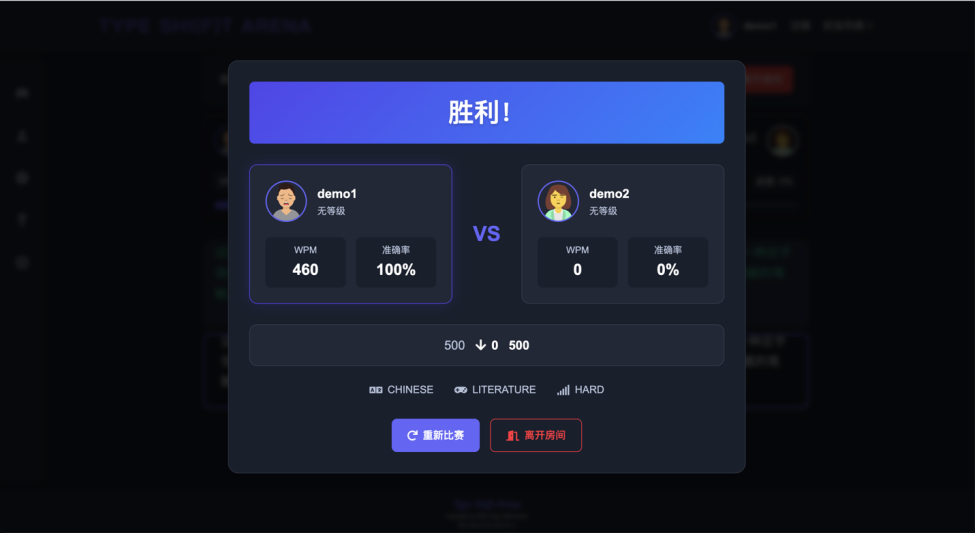
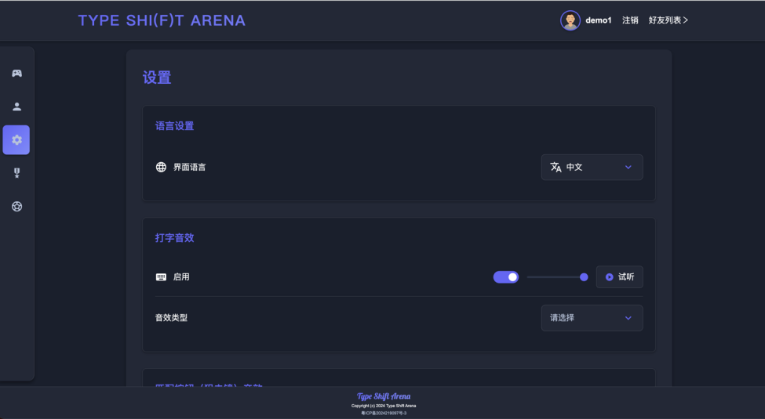
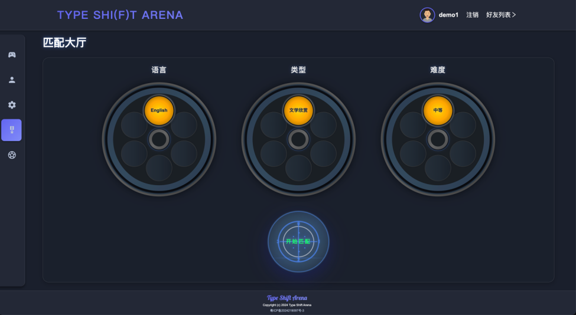

<!--
 * @Author: hiddenSharp429 z404878860@163.com
 * @Date: 2024-10-28 19:44:55
-->
<div align="center">
  
# Type Shi(f)t Arena 

<div>
  <a href="README.MD">
    
  </a>
  <a href="README_CN.MD">
    
  </a>
</div>

<div style="margin-top: 5px">
  <a href="CONTRIBUTING.MD">
    
  </a>
  <a href="CONTRIBUTING_CN.MD">
    
  </a>
</div>

---

</div>

Type Shi(f)t Arena is an engaging, competitive typing platform combining real-time gameplay with fun mechanics. It includes both a frontend built with Vue.js and a backend powered by Spring Boot, offering a seamless, robust user experience for typing enthusiasts. **This repo is the frontend part of the project.** backend repo is [here](https://github.com/SheathedSharp/Type-Shift-Arena-Backend)

## 🎮 Key Features (Frontend)
- **Real-Time Gameplay**: Dynamic matchmaking and multiple game modes, including casual and ranked matches, with live performance tracking.
- **Typing Practice**: Bubble-shooting practice mode with progressively challenging levels and real-time performance analytics.
- **User Interface**: Modern, responsive design with a glassy UI, smooth animations, and dark mode optimized for extended play sessions.
- **Multilingual Support**: Full internationalization with support for multiple languages (currently Chinese and English), with a scalable language system.

## 🛠️ Technical Stack (Frontend)
- **Framework**: Vue 3 (Composition API)
- **Tools**: Vite for building, WebSocket for real-time features, Element Plus for UI components, Font Awesome for icons
- **Design**: Responsive, component-based UI with custom animations

## Snapshot












## How to use

1. CD to project root
```bash
cd /path/to/project/root
```
2. Install dependencies
```bash
npm install
```
3. Run the project
```bash
npm run dev
```
